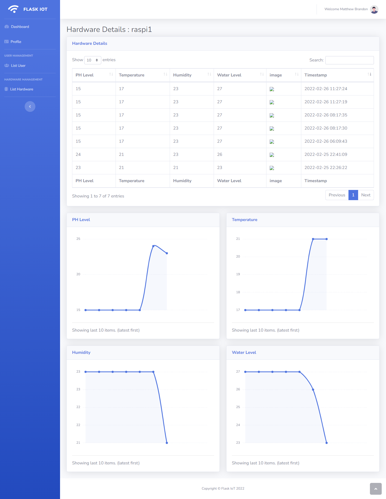

# Flask IoT : IoT Monitoring Dashboard & HTTP API

<strong>Deployed but still in development</strong>

### Features

- MySQL / MariaDB Database
- User Login & Register with session
- HTTP Request API for device connection
- Responsive frontend by SBAdmin admin panel template
- CRUD Data (User data & Hardware)
- Chart visualization
- more on going...

### For demo (link on repository about):

- Email : dondon@gmail.com
- Password : pintu123

### Preview of this system

  

  

